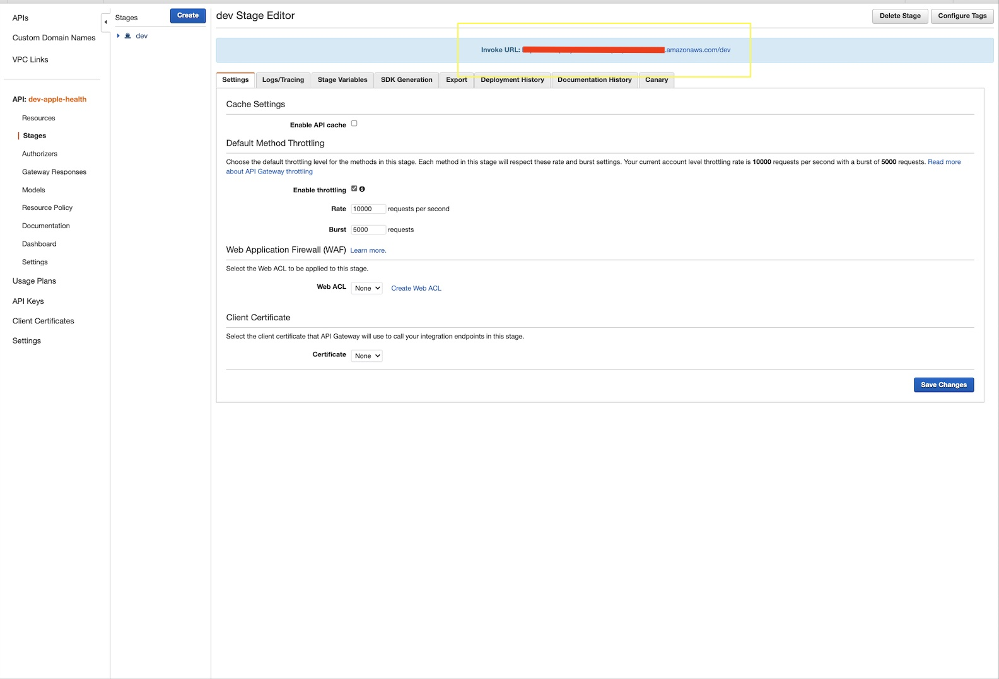

## Apple Health Calendar


A serverless framework that automates the conversion of past daily statistics from Apple Watch into a calendar event.

```mermaid
graph LR
    A[fa:fa-mobile iPhone / Apple Watch] -->|Auto Health Export|B
    B[AWS REST API] --> C[fa:fa-aws AWS Lambda]
    C -->|healthlake.py| D[convert to json to parquet]
    D -->|parse_parquet.py| E[collect latest stats <br> `health.parquet`]
    E -->|create-calendar.py| F[create `ics` file <br> apple-health-calendar.ics]
```

### Detailed Process

1. `/syncs` endpoint invokes the `healthlake.py` script to save the Apple Health export into the `AppleHealthData` table schema as a parquet file.  
2. `parse_parquet.py` then dedupes all parquet files and groups each metric by their latest unload date (saved as `health.parquet`)
3. `create_calendar.py` creates an `ics` calendar file with `health.parquet`. You can subscribe to this `ics` calendar to integrate with any existing Calendar service.

## Entity Relationship Diagram

```mermaid
classDiagram
    direction LR

    AppleHealthData --|> Sleep
    AppleHealthData --|> Dailys
    AppleHealthData --|> Macros

    Dailys  --|>AppleHealthEvent
    Macros --|>AppleHealthEvent
    Sleep --|>AppleHealthEvent

    class AppleHealthData { 
        date
        date_updated
        name
        qty
        source
        units
    }

    class AppleHealthEvent { 
        date
        description
        title
    }

    class Sleep { 
        sleep_analysis_asleep
        sleep_analysis_inBed
        sleep_analysis_sleepStart
    }


    class Macros { 
        carbohydrates
        protein
        total_fat
        fiber
        active_energy
    }

    class Dailys { 
        apple_exercise_time
        mindful_minutes
        step_count
        weight_body_mass
    }
```

## Project Goals

- Automate exports from iPhone (via [AutoExport](https://github.com/Lybron/health-auto-export))
- Trigger workflow automatically when AutoExport uploads into S3 endpoint.
- Create `read-only` data available in AWS S3 bucket.
- Files are refreshed in S3 bucket that personal calendar is subscribed to.

## Getting Started

This project uses `poetry` to manage environment and package dependencies

1. Setup project dependencies using `make setup`

```
# create virtual envs
poetry shell 
poetry install 

# install serverless plugin
sls plugin install -n serverless-wsgi 
sls plugin install -n serverless-python-requirements
```

2. Update `conf.py` to the location of the required s3 buckets
3. Run `sls deploy` to deploy the Cloudformation stack and collect the API endpoint found here.


**Use the `Invoke URL` within AWS API Gateway**

4. Trigger API export from `health-auto-export` using the API endpoint - remember to include the `/syncs` suffix to the endpoint because that's where the `serverless` will trigger the processes.


### Advanced

You can update the emojis and definitions by looking at the `config/column.mapping.yaml` file.

### Inspiration

- Work done by [`cleverdevil/healthlake`](https://github.com/cleverdevil/healthlake).
