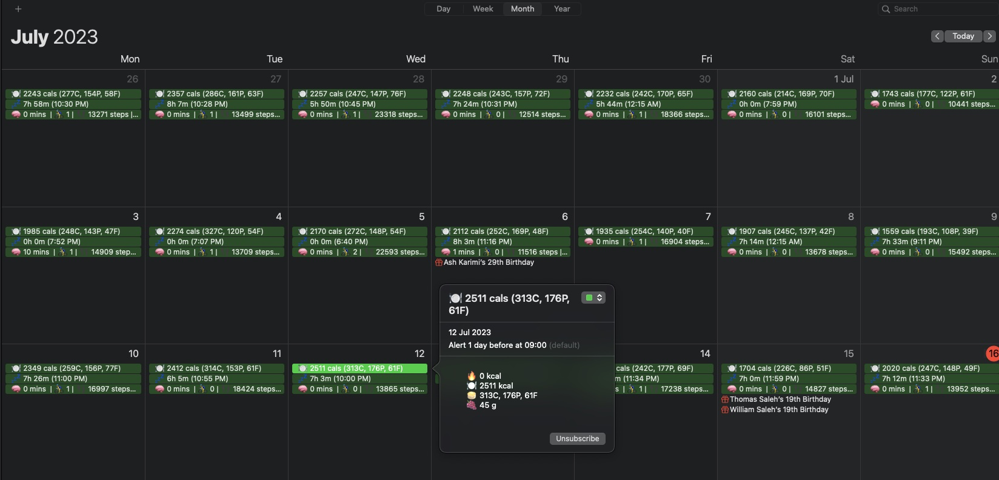
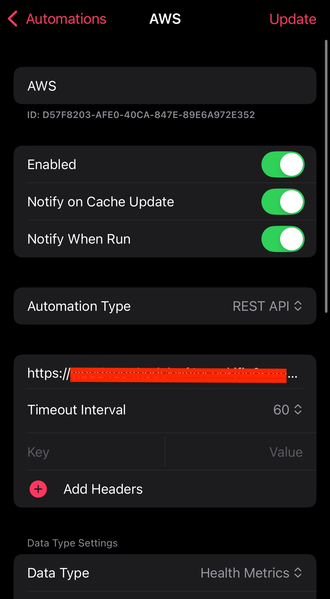

## Apple Health Calendar

### Github Actions

A serverless framework that automates the conversion of past daily statistics from Apple Watch into a calendar event.

```mermaid
graph LR
    A[fa:fa-mobile iPhone / Apple Watch] -->|Auto Health Export|B
    B[AWS REST API] --> C[fa:fa-aws AWS Lambda]
    C -->|ingest/lambda.py| D[saves to json]
    D -->|dbt-duckdb| E[transforms data and saves out to delta]
    E -->|calenadr/lambda.py| F[create `ics` file <br> apple-health-calendar.ics]
```

### Detailed Process

1. A lambda function URL endpoint invokes the `ingest/lambda.py` handler function  to save the Apple Health export as is within the defined `S3` bucket.
2. `dbt` alongside `duckdb` is used to transform and unnest this data to the format required for displaying information
3. `calendar/lambda.py` creates an `ics` calendar file from the output `S3` buckets. You can subscribe to this `ics` calendar to integrate with any existing Calendar service.

## Entity Relationship Diagram

```mermaid
classDiagram
    %% EventConfig holds the YAML configuration for a specific event type
    class EventConfig {
      +name: str
      +title_template: str
      +description_template: str
      +required_metrics: list[str]
      +from_yaml(yaml_path: Path, group_name: str): EventConfig
    }

    %% ConfigManager loads and manages EventConfig instances from YAML
    class ConfigManager {
      +config_path: str
      +event_configs: dict[str, EventConfig]
      +get_config(group_name: str): EventConfig
    }

    %% DataLoader loads a Parquet file from S3 and returns a DataFrame
    class DataLoader {
      +load_from_s3(s3_bucket: str, s3_path: str): pl.DataFrame
    }

    %% EventFactory creates calendar Event objects using DataFrame data and EventConfig
    class EventFactory {
      +create_event_for_date(event_date: date, df: pl.DataFrame, config: EventConfig): Optional[Event]
      -_extract_metrics(df: pl.DataFrame): dict[str, float | str]
      -_extract_units(df: pl.DataFrame): dict[str, str]
    }

    %% CalendarStorage handles saving Calendar objects locally and to S3
    class CalendarStorage {
      +s3_bucket: Optional[str]
      +save_local(calendar: Calendar, filename: str): str
      +save_to_s3(calendar: Calendar, filename: str, ics_content: Optional[str]): Optional[str]
    }

    %% CalendarGenerator coordinates the entire calendar generation process
    class CalendarGenerator {
      +config_path: str
      +s3_bucket: Optional[str]
      +calendar: Calendar
      +config_manager: ConfigManager
      +storage: CalendarStorage
      +add_events_from_s3(s3_bucket: str, s3_path: str, group_name: str): int
      +save_calendar(filename: str, save_to_s3: bool): None
    }

    %% Calendar and Event are from the ics library
    class Calendar {
      +events: set(Event)
    }
    
    class Event {
      +name: str
      +description: str
      +begin: datetime
      +make_all_day(): void
    }

    %% Relationships
    ConfigManager "1" --> "many" EventConfig : manages
    EventFactory ..> EventConfig : uses
    EventFactory ..> Event : creates
    CalendarGenerator --> ConfigManager : has
    CalendarGenerator --> CalendarStorage : has
    CalendarGenerator --> Calendar : maintains
    CalendarGenerator ..> DataLoader : uses
```

## Project Goals

- Automate exports from iPhone (via [AutoExport](https://github.com/Lybron/health-auto-export))
- Trigger workflow automatically when AutoExport uploads into S3 endpoint.
- Create `read-only` data available in AWS S3 bucket.
- Files are refreshed in S3 bucket that personal calendar is subscribed to.

## Getting Started

This project uses `uv` to manage environment and package dependencies

1. Setup project dependencies using `make setup`
2. Update `conf.py` to the location of the required `s3` buckets
3. Run `make deploy` to deploy the terraform stack and collect the API endpoint to be used within the iOS app

4. Trigger API export from `health-auto-export` using the API endpoint.

### Advanced

You can update the emojis and definitions by looking at the [`calendar/event_formats.yaml`](calendar/event_formats.yaml) file.

### Inspiration

- Work done by [`cleverdevil/healthlake`](https://github.com/cleverdevil/healthlake).
